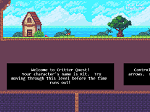
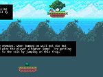
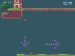
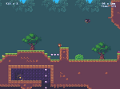
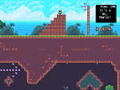
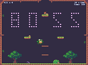

## Welcome to Critter Quest

Critter Quest is a basic platformer created using Phaser3.

[Live Demo (Version 1)](https://werkn.github.io/critter-quest/)
[Live Demo (Version 2)](https://werkn.github.io/critter-quest-v2/)

### Screenshots

### How to Install Critter Quest

To install Critter Quest to a server running Apache 2 on Ubuntu follow these instructions:

 - [How to Install Critter Quest](https://youtu.be/b4rpffbao60)

### Game Overview

Level overview and game walkthrough:

 - [Walkthrough](https://youtu.be/UGg3HrOG6Vo)

### Tiled / Contributing Maps

You can easily contribute maps to this repo by downloading Tiled and simply submitting maps as a pull request.  A quick tutorial on making maps for Critter Quest using Tiled can be found here:

 - [Using Tiled with Critter Quest](https://youtu.be/sGlBn37DqQw)

### Tileset and Audio Attribution

The awesome sprite work for this game was developed by, [ansimuz](https://ansimuz.itch.io/), visit his site here:

 - [https://ansimuz.itch.io/](https://ansimuz.itch.io/)
 
Demo Music by [Pascal Belisle](mailto:pacethemusician@hotmail.com)
 - [https://soundcloud.com/pascalbelisle](https://soundcloud.com/pascalbelisle)

### Tools Needed

For tilemaps I used Tiled which integrates great with Phaser3.  For an IDE I tend to use Vim, but others may find Visual Studio Code easier to use.

 - [Tiled](https://www.mapeditor.org/) 
 - [Vim](https://www.vim.org/download.php)
 - [Visual Studio Code](https://code.visualstudio.com/download)
